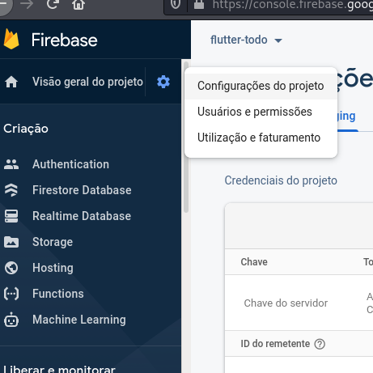
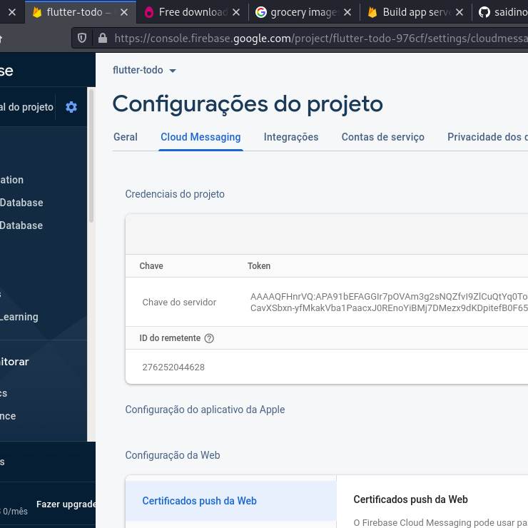
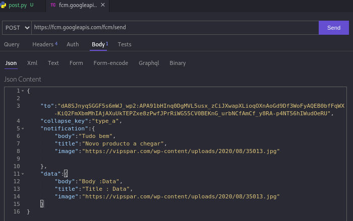
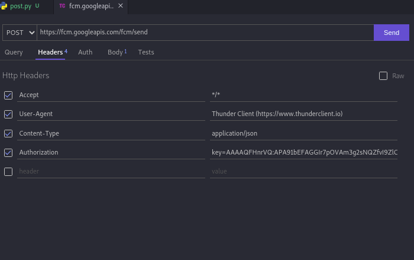

# firebase_fcm_utls

Para mandar messagens atraves de server python request http/...
>1 Obter o link do servidor de fcm
[](https://fcm.googleapis.com/fcm/send)
# 2 ter achave do seu projecto firebase de cloud messaging: clique no icon de settings e opcion de Configuracoes do projecto


# 2 apos abrira a tela onde tem as tab bares e escolhes a de cloud messaging



ai tens o chave do servidor

# FAZENDO POST COM POSTMAN
precisa token do device/
para obter otoken de FirebaseMessaging nos androids atraves de flutter :
```dart
  getToken() async {
    await FirebaseMessaging.instance.getToken().then((value) {
      print(value);
      Get.defaultDialog(
          content: Column(
        children: [
          Text('Notification Token'),
          TextFormField(
            initialValue: '$value',
          ),
        ],
      ));
    });
  }

```

# No body preecher os dados de notificacao



# No Headers preecher os dados:


>> os mais requeridos

Content-Type : application/json

Authorization : key=chave do servidor do firebase

# POST USANDO PYTHON


```py


import json
import requests as rq

# server uri
fcm_server='https://fcm.googleapis.com/fcm/send'
# [headers]
auth='key=AAAAQFHnrVQ:APA91bEFAGGIr7pOVAm3g2sNQZfvI9ZlCuQtYq0Toy-gHqEYlA_wybPGls9wrjcoW7FNoyXRqmZi2l5CavXSbxn-yfMkakVba1PaacxJ0REnoYiBMj7DMezx9dKDpitefB0F652V7vy7'
content_type='application/json'
headers={
    'Content-Type':content_type,
    'Authorization':auth
}

# USERS [esses ids obtive nos telefones da minha mulher e da minha mae]
wife='ePbRZsCgTDuHwVhHbTsEGT:APA91bGJY2xrgKlMnD7Inf95jjPBc404sTK2nfh4fqb_HEWzHvgOCHrzYV-K_Hu68X0941kx_1coFUQcl9xfRaShZhmha6lMixGnXXFOjkWN8NG8L6z6msrj2I5f8Kk1m7HOcE0lQUNV'
mine="dA8SJnyqSGGF5s6mWJ_wp2:APA91bHInq0DgMVL5usx_zCiJXwapXLioqOXnAoGd9Df3WoFyAQEB0bfFqWX-KiQ2FmXbmMhIAjAXuUkTEPZxe8zPwfJPrRiWG55CV0BEKnG_urbNCfAmCf_y8RA-p4NT56hIWudOeRU"
# [body]
message=input('message')
title =input('title')
image_url=input('image link')
if(len(image_url) <10):
    image_url='https://st.depositphotos.com/1063437/2337/i/950/depositphotos_23373292-stock-photo-groceries-in-wicker-basket-including.jpg'
body={
    "to":wife,
    "notification":{
        "body":message,
        "title":title,
        "image":image_url
        
    },
    "data":{
        "body":"Body :Data",
        "title":"Title : Data",
        "image":"https://vipspar.com/wp-content/uploads/2020/08/35013.jpg"
    }
}
from datetime import datetime,time
response=rq.post(fcm_server,headers=headers,data=json.dumps(body))
now=datetime.now().hour
with open(f'response_{d}.json','w+') as f:
    f.write(response.json())
print(post.json())


```
